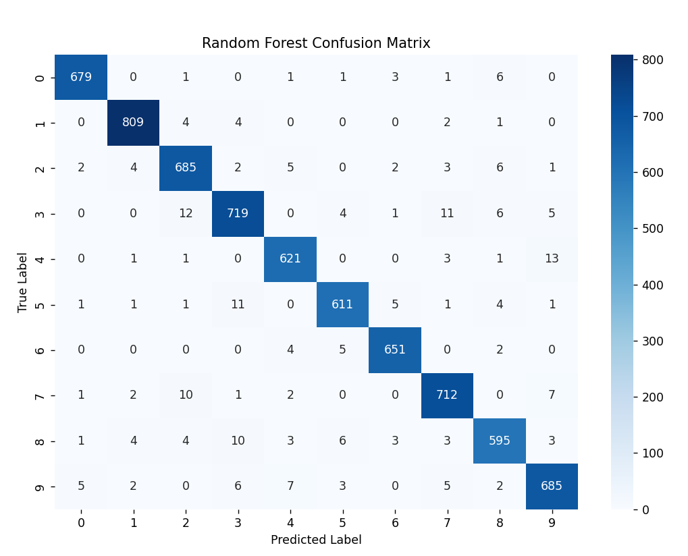

### README for Random Forest Classifier Example

---

#### Overview

This project demonstrates how to use the **Random Forest Classifier** from the `sklearn` library to classify randomly generated data. The code trains the classifier, evaluates its performance using various **evaluation metrics** such as accuracy, precision, recall, and F1-score, and plots the decision boundary of the trained model along with the data points.

---

#### Files

1. **random_forest_classifier.py**:
    - Contains the complete implementation of the Random Forest Classifier example.
    - The code:
        - Generates a random dataset with two features and two classes.
        - Splits the dataset into training and testing sets.
        - Trains a Random Forest Classifier on the training data.
        - Evaluates the model using common evaluation metrics.
        - Plots the decision boundary and data points.

---

#### Requirements

To run the project, you'll need the following Python libraries:

- **numpy**: for handling numerical operations.
- **matplotlib**: for plotting the data and decision boundaries.
- **seaborn**: for enhanced data visualization, specifically for the confusion matrix.
- **scikit-learn**: for machine learning models and evaluation metrics.

You can install these dependencies by running:

```bash
pip install numpy matplotlib seaborn scikit-learn
```

---

#### How to Run

1. Clone or download the repository.
2. Navigate to the project directory.
3. Run the Python script:

```bash
python Question{#number}.py
```

---

#### Evaluation Metrics

The model is evaluated using the following metrics:

- **Accuracy**: Measures the overall correctness of the model's predictions.
- **Precision**: Indicates the percentage of correct positive predictions.
- **Recall**: Represents the model's ability to identify all positive instances.
- **F1-Score**: A balance between precision and recall, providing a single metric for overall performance.

These metrics are calculated after the model has made predictions on the test data, and the results are printed to the console.

### This is the confusion matrix for the SVM Classifier:


### This is the confusion matrix for the Random Forest Classifier:




---

#### Example Output

When you run the script, the following outputs will be displayed:

1. **Performance metrics** (accuracy, precision, recall, F1-score).
2. **Decision Boundary Plot**: A 2D plot showing the decision boundary of the Random Forest model, data points, and class regions.

---

#### Project Structure

- **random_forest_classifier.py**: The main Python script containing the Random Forest implementation.

---

#### License

This project is licensed under the MIT License.

---

#### Author

- **Lucas** 

---

This README provides an overview of how to run the Random Forest Classifier example, the dependencies required, and how to interpret the results.
